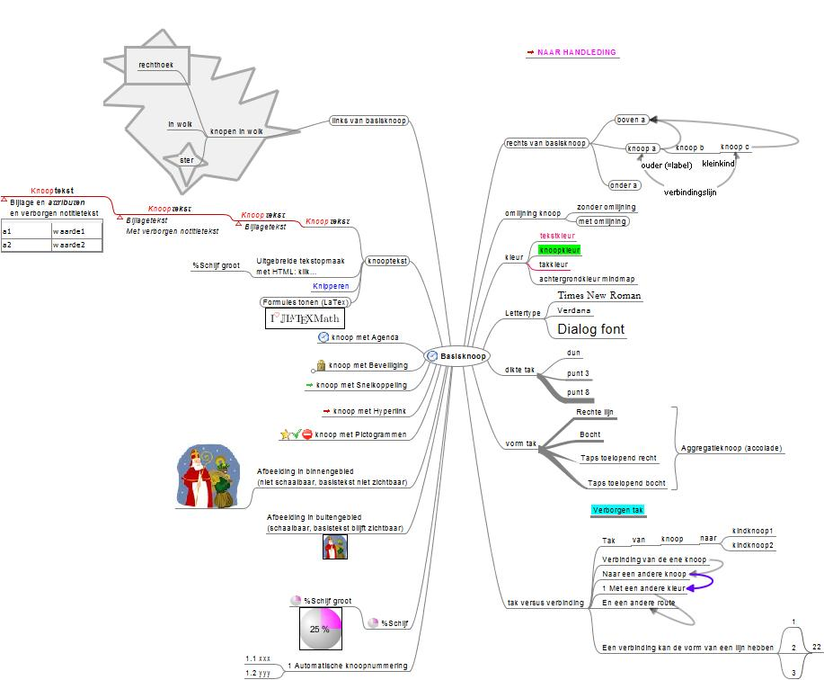
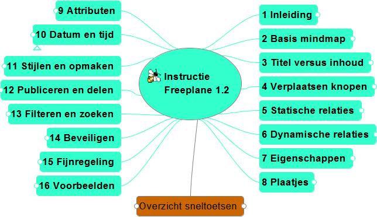

<!-- toc -->

Voor de meest recente/uitgebreide informatie: bekijk de Engelse pagina's met Google vertalen naar het Nederlands.

Deze pagina beschrijft het maken van mindmaps met de nieuwste versie van Freeplane (1.2.x) welke zich nog in alfa-stadium bevindt. Deze versie is voor de meeste doeleinden voldoende stabiel om gebruikt te worden. Voor een inleiding in wat mindmaps zijn en voorbeelden van mindmaps, ga naar de [**Gallerij met voorbeelden**](http://www.freeplane.org/wiki/index.php/Mind_Map_Gallery/Dutch). Voor het downloaden van Freeplane en het zelf maken van een mindmap, zie hieronder. De verwachting is dat in de zomer van 2011 1.2 in beta fase gaat en definitief wordt gemaakt.

# Inleiding Freeplane 1.2

Bij Freeplane wordt elk onderwerp een **knoop** genoemd. Een knoop is een plaats waar informatie kan worden geraadpleegd of een functie kan worden uitgevoerd. Een knoop heeft op het beeldscherm een binnengebied en een buitengebied. In het binnengebied kunnen een titeltekst, pictogram, snelkoppeling, hyperlink en een afbeelding (met vaste grootte) worden getoond. Het binnengebied kan verder zichtbaar worden worden gemaakt door deze te omlijnen. Het buitengebied bevindt zich onder het binnengebied. In het buitengebied kan een inhoudelijke tekst, notitietekst, attributenlijst, en schaalbare afbeelding worden getoond. Deze informatie kan naar keuze worden verborgen en alleen  getoond als de knoop is geselecteerd.

De titel bevat meestal niet meer dan enkele woorden. In de titel kan ook een formule worden weergegeven (LaTeX). De titel kan in plaats van tekst ook een formule bevatten. Deze begint, net als bij een spreadsheet, met “=” en wordt automatisch uitgerekend. En verder kan een tijdstip worden opgegeven waarop een signalering moet worden gegeven (**agendafunctie**).

Aan/onder het gebied van de basistekst kunnen de inhoud, een notitie, attributen en een externe (schaalbare) afbeelding  worden getoond.  De **notitie** is van oorsprong bedoeld voor het presenteren van een document in een afzonderlijk, schermbreed venster. Een **attribuut** bestaat uit een kenmerk met een waarde.  Er kan worden ingesteld dat deze velden permanent zichtbaar zijn of alleen als de knoop is geslecteerd.

Er is één stam(ouder)knoop  die de vorm heeft van een ovaal.  Hieruit komen **takken** die een reeks van knopen verbinden die een ouder-kind relatie hebben.  Daarnaast kunnen twee willekeurige knopen worden verbonden met een **verbindingslijn**  (of pijl). Twee knopen kunnen digitaal worden verbonden met een **snelkoppeling**  waarmee de focus van de ene naar de andere knoop kan worden verplaatst, of via een **hyperlink** met een programma of bestand op de computer of op internet.. Knopen binnen een tak kunnen visueel worden verbonden door een **wolk**. Ten slotte kunnen twee of meer knopen via een **accolade**  samenkomen in een **aggregatieknoop**, kan een koop een taartpunt (%shijf) tonen en kunnen knopen worden voorzien van een automatische nummering.

**Belangrijkste menu's**
De basiskenmerken van een knoop zijn toegankelijk via menu Knoop  en de andere elementen via menu Knoopkenmerken.

# Downloaden Freeplane 1.2.X (Windows, MAC, Linux)

Houd deze pagina in de gaten: er wordt gewerkt aan een nieuwe, betere menustructuur en dit betekent dat er regelmatig een nieuwe versie uit komt. Naar verwachting zal na de zomer van 2011 de definitieve versie uitkomen.

De laatst beschikbare ontwikkelversie van Freeplane 1.2.X is [hier](http://www.freeplane.org/preview/) te downloaden. Voor de Windows versie, kies Freeplane-Setup-1.2......exe. Houd er wel rekening mee dat de software ontwikkelaars zonder waarschuwing veranderingen kunnen aanbrengen waardoor sommige delen misschien niet meer of anders werken. Er kunnen ook fouten optreden. Zie onder voor het installeren van de Nederlandse spellingcontrole.  
**BELANGRIJK** Vanaf versie 1.2.5 is de menustructuur sterk vereenvoudigd. Nog niet alle voorbeelden zijn hier op aangepast.

# Instructie en handleiding Freeplane 1.2

Freeplane wordt geleverd met een instructie en een handleiding. Beide zijn te vinden in het menu Help van Freeplane. De instructie zie je ook hiernaast: klik onder het plaatje  op de link "Instructie" om deze te openen.

Als je Freeplane gaat gebruiken, bekijk dan eerst de volgende instructievideo's: 

* [**Instructie voor de beginnende gebruiker**](http://www.kioo.nl/freeplane/FreeplaneInstructie/BasisGebruikerInstructie.htm). Deze video behandelt alleen het bekijken van mindmaps.
* [**Instructie voor de beginnende maker van mindmaps**](http://www.kioo.nl/freeplane/FreeplaneInstructie/Basisinstructie-knoopbehandeling.htm). Deze instructie behandelt de basisbehandeling van knopen.
 

Volg verder de Leeswijzer uit de handleiding en bekijk hieronder voor de belangrijkste instellingen die je zelf kunt wijzigen/aanbrengen.

# Instellingen

## Het opmaakpaneel tonen
Freeplane biedt vele mogelijkheden om kleuren, vormen en groottes van knopen en takken in te kunnen stellen. Nieuw in Freeplane 1.2 is het gebruik van een *Opmaakpaneel* waarin alle in te stellen elementen van een knoop/tak bij elkaar staan. Het opmaakpaneel wordt getoond door *Beeld > Opmaakpaneel* te kiezen. 
Het opmaakpaneel toont de actuele inhoud van de geselecteerde knoop. Elke verandering die wordt aangebracht, is direkt te zien in de knoop of de tak van de geselecteerde knoop.

## Installeren Nederlandse spellingcontrole
De Nederlandstalige [[#Spell_checker|**spellingcontrole**]] wordt niet automatisch geïnstalleerd. Dit moet je dus altijd zelf doen. In de handleiding staat hoe.

## Installeren: Klikken om te selecteren
Standaard selecteert Freeplane een knoop als de muiscursor zich boven de knoop bevindt. Als je dit niet handig vindt, kun je via *Instellingen > Gedrag* instellen dat één maal met de linker muistoets klikken leidt tot selectie.

## Installeren: Automatische takkleur uitzetten
Freeplane gebruikt het bestand standaard.mm om de kleur van de takken, knopen en ander kenmerken van de nieuwe mindmap te bepalen. In standaard.mm is vastgelegd dat elke nieuwe tak automatische een andere kleur krijgt. Om dit te veranderen in standaard.mm, doe het volgende:

* open een nieuwe (standaard) mindmap;
* Haal in het opmaakpaneel het vinkje weg bij *Automatische takkleur*;
* Kies *Bestand > Opslaan als*
* De bovenste regel van het scherm dat opent is een afrolmenu. Kies hier de optie *Door de gebruiker gedefinieerde mindmapstijlen*
* Vul bij *file name* in: **standaard.mm**
* Druk op <Save>  
De volgende keer dat je een nieuwe mindmap maakt zullen de takken geen kleur hebben.
Wat je ook zou kunnen doen is de bovenstaande, aangepaste mindmap onder een andere naam dan standaard te bewaren (bijvoorbeeld: *mijnstandaard.mm*). Freeplane gebruikt dit bestand als standaard indien je *Bestand > Nieuwe mindmap met stijl* kiest, en onder Gebruikerstijlen *mijnstandaard* kiest.

## Installeren: F3-toets voor *Bewerken knooptekst in hulpvenster*
Het kan handig zijn om sneltoets F3 toe te wijzen aan de functie *Bewerken knooptekst in hulpvenster*. De beschrijving hoe dit moet staat in de Handleiding.

<!-- ({Category:Documentation}) ({Category:Translation}) -->

