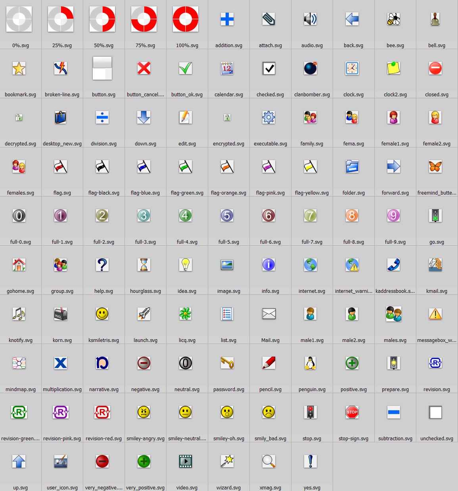

<!-- toc -->

## Add your own icons to Freeplane

Icons can be easily installed by copying them to the directory

    <freeplane_userdir>/icons

The function *Tools -> Open user directory* takes you to the "freeplane_userdir". Create the directory *icons* if necessary and copy your own icons to it.

Restart Freeplane if necessary: you can now use your own icons in your maps.

## Replace a built-in Freeplane icon

If one of your own icons has the same filename than a standard Freeplane icon, this standard icon will be overridden. This is perfectly safe. Just remember it if you share your map with another Freeplane user, he or she will see the standard icons, not yours.

You can find the standard icons filenames in [this folder](https://github.com/freeplane/freeplane/tree/1.8.x/freeplane/src/viewer/resources/images/icons) of the Freeplane sources (this link lead to the 1.8.x version of Freeplane, but you can change this with the "branch" button).

Here's a preview of the icons and their filenames for Freeplane 1.8.x:

## Some sources of free icons

* [Google Black and white](http://gizmodo.com/google-just-released-hundreds-of-cool-icons-that-you-ca-1648797992)
* [silk icons](http://www.famfamfam.com/lab/icons/silk/)
* [Freeplane User Icons add-on](http://www.freeplane.org/wiki/index.php/Add-ons#User_Icons)

<!-- ({Category:Advanced}) -->

